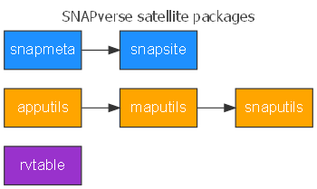

<!-- README.md is generated from README.Rmd. Please edit that file -->

```{r setup, include = FALSE}
knitr::opts_chunk$set(
  collapse = TRUE, comment = "#>", fig.path = "man/figures/README-",
  message = FALSE, warning = FALSE, error = FALSE, tidy = TRUE
)
```
# snaputils

[](https://travis-ci.org/leonawicz/snaputils)
[](https://ci.appveyor.com/project/leonawicz/snaputils)
[](https://codecov.io/github/leonawicz/snaputils?branch=master)

`snaputils` contains utilities for Shiny app development.
The package inherits primarily from `apputils`, which contains common utility functions, settings and references for use across multiple Shiny apps.
It also imports `maputils`. As the name suggests, unlike the other two packages, `snaputils` is specific to a SNAP context. 
All three packages are satellite members of the SNAPverse collection of R packages.

```{r is_md, echo = FALSE}
is_md <- knitr::opts_knit$get("rmarkdown.pandoc.to") == "markdown_github-ascii_identifiers"
```

```{r md_doc1, echo = FALSE, results = "asis", eval = is_md}
cat('<p style="text-align:center;"></p><br>')
```

```{r html_doc1, echo = FALSE, results = "asis", eval = !is_md}
cat('<p style="text-align:center;"></p>')
```

## Installation and bug reporting

Install the latest development version from github with

```{r gh-installation, eval = FALSE}
# install.packages("devtools")
devtools::install_github("leonawicz/snaputils")
```

Please file a minimal reproducible example of any clear bug at [github](https://github.com/leonawicz/snaputils/issues).

## Reference

The complete set of satellite packages is shown below.

```{r md_doc2, echo = FALSE, results = "asis", eval = is_md}
cat('<p style="text-align:center;"></p><br>')
```

```{r html_doc2, echo = FALSE, results = "asis", eval = !is_md}
cat('<p style="text-align:center;"></p>')
```

```{r md_doc3, echo = FALSE, results = "asis", eval = is_md}
cat('[Package reference and function documentation](https://leonawicz.github.io/snaputils/)')
```
